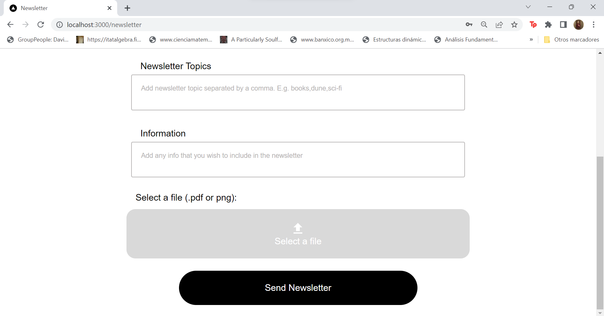

# Newsletter - Single Page Application

This is the SPA built for the project using Next.js and JavaScript. The initial design made in figma can be seen in the following [link](https://www.figma.com/file/SDD1ScI2e0dKprSppGFESm/Newsletter?type=design&node-id=7-325). 

## 💻 Installation

This SPA can be deployed by the docker-compose file or by building an image using it's DockerFile and runing it. But in case that it needs to be deployed without container, it can be done using the following steps:

**For Windows/Linux/MacOS:**

```bash
# Installation of dependencies
npm install # Or yarn install

# Execution for a development envrionment
npm run dev

```
## 💻 Usage
1. On the log in page, you can access if you have created an account, otherwise, you'll need to go to the sign up page.


2. On the sign up page, you can create a new account to access.


3. If you have created a recipient lists previously, you will be able to send a newsletter.




4. On the recipient list you can create a recipients list and, if previously created one, you can add recipients.


5. After you send a newsletter, you will see a new mail in your inbox.


6. And you can unsubscribre from certain topics or for all newsletters.


